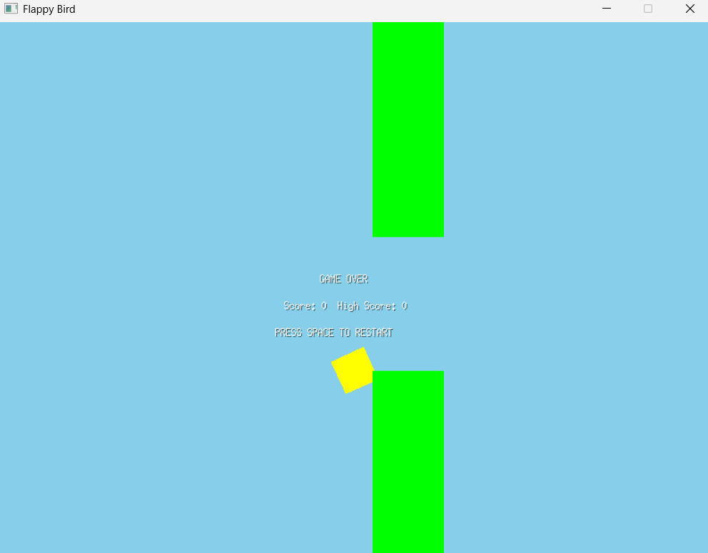

# Flappy Bird in Go

[](https://golang.org/dl/)
[](https://opensource.org/licenses/MIT)

A simple Flappy Bird clone implemented in Go using the Ebiten game engine. This project was created using the
[OpenRouter](https://openrouter.ai) model `deepseek/deepseek-r1-0528:free` through Cline extension, with a prompt-driven
development process that emphasized iterative planning and implementation.

## Development Process

This game was developed using an iterative approach with the following steps:

1. Created a `plan.md` file to outline key systems and requirements
2. For each system (bird physics, pipe generation, collision detection, etc.):
   - Defined key considerations and requirements
   - Specified interactions with other systems
   - Outlined necessary logic and mathematical calculations
3. Conducted iterative reviews:
   - Verified system integration points
   - Identified potential issues
   - Updated the plan to address complexities
4. Implemented one function at a time, ensuring alignment with the plan
5. Repeated the process until all systems were implemented and tested

The complete development prompt and iterative planning process can be reviewed in the [plan.md](plan.md) file.



## Features

- Bird physics with gravity and flap mechanics
- Randomly generated pipes with varying heights
- Collision detection (pipes, ground, ceiling)
- Score tracking with high score persistence
- Game states: Start, Play, Game Over
- Simple UI with instructions and score display
- Keyboard controls (SPACE key)

## Installation

1. Ensure you have Go installed (version 1.22 or higher)
2. Clone the repository:

   ```bash
   git clone https://github.com/francojeferson/flappy-bird-go.git
   cd flappy-bird-go
   ```

3. Install dependencies:

   ```bash
   go get github.com/hajimehoshi/ebiten/v2
   ```

4. Run the game:

   ```bash
   go run .
   ```

## How to Play

1. Press **SPACE** to start the game
2. Press **SPACE** to make the bird flap upward
3. Navigate through the pipe gaps to score points
4. Avoid hitting pipes, the ground, or the ceiling
5. When you crash, press **SPACE** to restart

Each pipe you pass through scores 1 point. Try to beat your high score!

## Controls

- **SPACE**: Start game / Flap / Restart after game over

## Project Structure

```ini
flappy-bird-go/
├── main.go        # Main game implementation
├── plan.md        # System design and planning document
├── go.mod         # Go module definition
├── go.sum         # Go dependencies checksum
└── README.md      # This file
```

## Dependencies

- [Ebiten](https://ebiten.org/) - Game engine for Go
- Go Standard Library

## Contributing

Contributions are welcome! Please follow these steps:

1. Fork the repository
2. Create a new branch (`git checkout -b feature/your-feature`)
3. Commit your changes (`git commit -am 'Add some feature'`)
4. Push to the branch (`git push origin feature/your-feature`)
5. Create a new Pull Request

## License

This project is licensed under the MIT License - see the [LICENSE](LICENSE) file for details.
